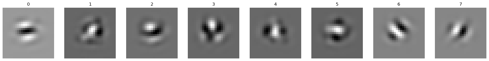
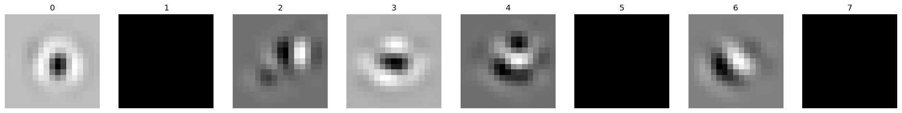
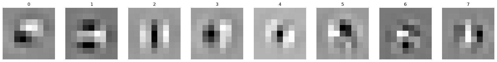
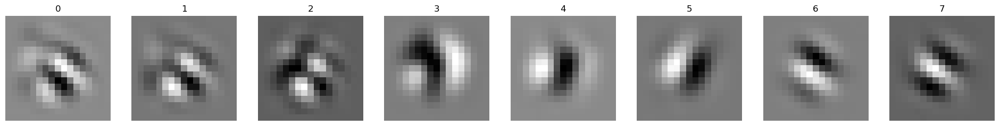
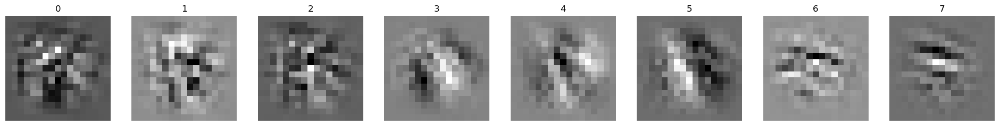
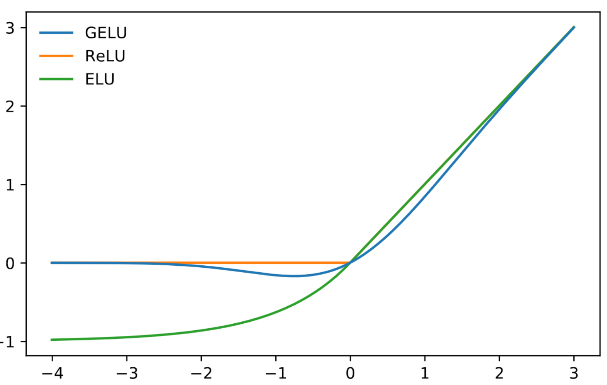
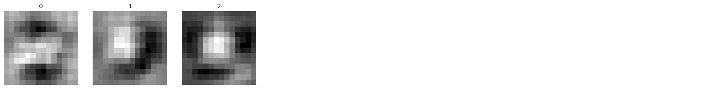
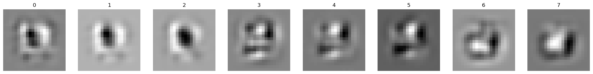
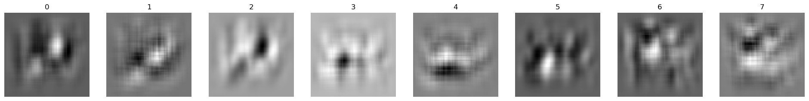

# Update 2023-11-21

# Receptive fields

## Kernel size
Kernels after last conv layer in architecture shown:
```
Sequential(
  (0): Conv2d(1, 32, kernel_size=(9, 9), stride=(1, 1), padding=(4, 4)) <--- greyscale input
  (1): ReLU(inplace=True)
  (2): Conv2d(32, 1, kernel_size=(9, 9), stride=(1, 1), padding=(4, 4)) <--- note: bottleneck
  (3): ReLU(inplace=True)
  (4): Conv2d(1, 32, kernel_size=(9, 9), stride=(1, 1), padding=(4, 4))
  (5): ReLU(inplace=True)
  (6): Conv2d(32, 32, kernel_size=(9, 9), stride=(1, 1), padding=(4, 4)) <--- RFs from here
  (7): ReLU(inplace=True)
  (8): Flatten(start_dim=1, end_dim=-1)
  (9): Linear(in_features=32768, out_features=1024, bias=True)
  (10): ReLU(inplace=True)
  (11): Linear(in_features=1024, out_features=10, bias=True)
  (12): Softmax(dim=-1)
)
```
Kernel size = 9 (orig)

Kernel size = 7

Kernel size = 5

Kernel size = 3


-> Kernel size does _not_ matter as much!

## Activation Functions
Kernel size 5, color input

ELU » ~ 52% accuracy

GELU » ~ 54% accuracy

SELU » ~ 50% accuracy

Tanh » ~ 53% accuracy

RELU » ~ 62% accuracy

- act functions have a huge impact
- closer to 0 for neg -> better RFs?


-> Use GELU!

## Pooling

Pool in early layers:
```
Sequential(
  (0): Conv2d(3, 32, kernel_size=(3, 3), stride=(1, 1), padding=(1, 1))
  (1): GELU(approximate='none')
  (2): AvgPool2d(kernel_size=2, stride=2, padding=0)                    <--- Pool
  (3): Conv2d(32, 1, kernel_size=(3, 3), stride=(1, 1), padding=(1, 1)) <--- RFs shown
  (4): GELU(approximate='none')
  (5): AvgPool2d(kernel_size=2, stride=2, padding=0)                    <--- Pool
  (6): Conv2d(1, 32, kernel_size=(3, 3), stride=(1, 1), padding=(1, 1)) <--- RFs shown
  (7): GELU(approximate='none')
  (8): Conv2d(32, 32, kernel_size=(3, 3), stride=(1, 1), padding=(1, 1)) <--- RFs shown
  (9): GELU(approximate='none')
  (10): Flatten(start_dim=1, end_dim=-1)
  (11): Linear(in_features=2048, out_features=1024, bias=True)
  (12): GELU(approximate='none')
  (13): Linear(in_features=1024, out_features=10, bias=True)
  (14): Softmax(dim=-1)
)
```
Bottleneck:

Mid:

Last:


Pool in late layers:
```
Sequential(
  (0): Conv2d(3, 32, kernel_size=(5, 5), stride=(1, 1), padding=(2, 2))
  (1): ReLU(inplace=True)
  (2): Conv2d(32, 1, kernel_size=(5, 5), stride=(1, 1), padding=(2, 2)) <--- RFs shown
  (3): ReLU(inplace=True)
  (4): Conv2d(1, 32, kernel_size=(5, 5), stride=(1, 1), padding=(2, 2)) <--- RFs shown
  (5): ReLU(inplace=True)
  (6): AvgPool2d(kernel_size=2, stride=2, padding=0)                    <--- Pool
  (7): Conv2d(32, 32, kernel_size=(5, 5), stride=(1, 1), padding=(2, 2)) <--- RFs shown
  (8): ReLU(inplace=True)
  (9): AvgPool2d(kernel_size=2, stride=2, padding=0)                    <--- Pool
  (10): Flatten(start_dim=1, end_dim=-1)
  (11): Linear(in_features=2048, out_features=1024, bias=True)
  (12): ReLU(inplace=True)
  (13): Linear(in_features=1024, out_features=10, bias=True)
  (14): Softmax(dim=-1)
)
```
Bottleneck:

Mid:

Last:


Pool everywhere:
```
Sequential(
  (0): Conv2d(3, 32, kernel_size=(5, 5), stride=(1, 1), padding=(2, 2))
  (1): ReLU(inplace=True)
  (2): AvgPool2d(kernel_size=2, stride=2, padding=0)                    <--- Pool
  (3): Conv2d(32, 1, kernel_size=(5, 5), stride=(1, 1), padding=(2, 2)) <--- RFs shown
  (4): ReLU(inplace=True)
  (5): AvgPool2d(kernel_size=2, stride=2, padding=0)                    <--- Pool
  (6): Conv2d(1, 32, kernel_size=(5, 5), stride=(1, 1), padding=(2, 2)) <--- RFs shown
  (7): ReLU(inplace=True)
  (8): AvgPool2d(kernel_size=2, stride=2, padding=0)                    <--- Pool
  (9): Conv2d(32, 32, kernel_size=(5, 5), stride=(1, 1), padding=(2, 2)) <--- RFs shown
  (10): ReLU(inplace=True)
  (11): AvgPool2d(kernel_size=2, stride=2, padding=0)                    <--- Pool
  (12): Flatten(start_dim=1, end_dim=-1)
  (13): Linear(in_features=128, out_features=1024, bias=True)
  (14): ReLU(inplace=True)
  (15): Linear(in_features=1024, out_features=10, bias=True)
  (16): Softmax(dim=-1)
)
```
Bottleneck:

Mid:

Last:


- Pooling has a huge impact (! but consecutive conv layers "recover") -> only pool after first layer? Influence on time not that big in the end...

# RF development through training

- [Retinal first layer](../../imgs/rf_development/retinal_l0.html)
- [Retinal last layer](../../imgs/rf_development/retinal_l8.html)
- [Lindsey first layer](../../imgs/rf_development/lindsey_l0.html)
- [Lindsey last layer](../../imgs/rf_development/lindsey_l6.html)

# Time consumption

## Contribution to training time


- most expensive: backwards pass through first conv layer and pool
- first layers weights almost dont change... -> freezing helps, for 160x120 only half the computation time!
- reduce number of channels here!
- alternative: combine first two layers (conv with stride)

## Individual analysis

model: only conv layer


model: conv layer and avg pool


# Outlook / ideas backlog

- make transform to embed images in RL-viewport (160x120)
  - how "far" still able to detect somewhat reliably?
  - able to encode position?
- combine ideas in retinal & analyze
- continue time consumption analysis