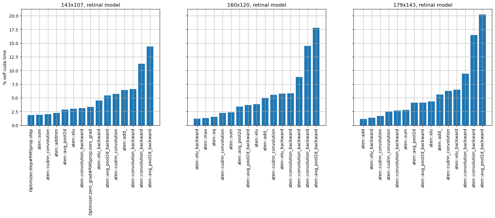

# Update 2024-01-16
## SPD - Space to Depth
### Recap: Main Problems identified in Retinal architecture
- Pooling layers "destroy" Receptive Fields
<!--  -->
- Additional backpropagation step through pooling layers time intensive
<!--  -->

### What are Space to Depth Convolutions

- Idea: move spatial dimension into channels
- no additional backprop step
- model able to "learn" downsampling strategy

### First tests & results
Layer 1 (BP):

Layer 4 (V1):


#### Additional benefits:
- even without regularization first layer trains better -> color filters
- effectively larger receptive fields -> finer structures possible

## Distance "simulation"

|||
|---|---|
- no regularization needed for first layer anymore -> multiscale introduces proper rfs now
- better estimate of how well model is suited for rl environment
- downside: training takes now _a lot_ more epochs

### Performance over scale

- Models
  - all:
    - no bottleneck, channel sizes: [16,32,32,64]
  - mod2:
    - spd 4 at input layer, then no downsampling, AdaptivePool at end to get same size as retinal
    - kernel size 7
  - mod3:
    - spd 2 at first two layers
    - kernel size 7 (!)


- model even outperforms previous model (claiim without statistical significance check :D)
  - continuous downsampling best
  - generalizes better for larger images
- training time for mod3 comparable

Mod3 Architecture:
```
----------------------------------------------------------------------------
Retina                                   [1, 10]                   --
├─SpaceToDepth: 1-1            !         [1, 12, 60, 80]           --
├─Conv2d: 1-2                  "BP"      [1, 16, 54, 74]           9,424
├─ELU: 1-3                               [1, 16, 54, 74]           --
├─SpaceToDepth: 1-4            !         [1, 64, 27, 37]           --
├─Conv2d: 1-5                  "RGC"     [1, 32, 21, 31]           100,384
├─ELU: 1-6                               [1, 32, 21, 31]           --
├─Conv2d: 1-7                  "LGN"     [1, 32, 15, 25]           50,208
├─ELU: 1-8                               [1, 32, 15, 25]           --
├─Conv2d: 1-9                  "V1"      [1, 64, 9, 19]            100,416
├─ELU: 1-10                              [1, 64, 9, 19]            --
├─AdaptiveMaxPool2d: 1-11                [1, 64, 3, 2]             --
----------------------------------------------------------------------------
FC
├─Flatten: 1-12                          [1, 384]                  --
├─Linear: 1-13                           [1, 128]                  49,280
├─ELU: 1-14                              [1, 128]                  --
├─Linear: 1-15                           [1, 128]                  16,512
├─ELU: 1-16                              [1, 128]                  --
├─Linear: 1-17                           [1, 10]                   1,290
├─Softmax: 1-18                          [1, 10]                   --
----------------------------------------------------------------------------
```

### RFs?
#### Layer 1 (BP):


#### Layer 2 (RGC):


#### Layer 3 (LGN):


#### Layer 4 (V1):


- Architecture allows for interpretable RFs
- Question: Desirable to have Gabors so "early"?
- Multiscale / longer slower training makes model learn more meaningful filters already in layer 1 (side note: even without any regularization, just a bit more noisy)
- training note: smaller batch size seems beneficial

### Bottlenecked?
set LGN channel number to 1:

#### Layer 1 (BP):


#### Layer 2 (RGC):


#### Layer 3 (LGN):


#### Layer 4 (V1):


- more complex structures earlier
- no center surround
- to be fair: in lindsey paper bottleneck in RGC layer

## Connectivity plots

- Calculate sum over absolute values over weights for each input channel

| Layer | Retinal Base Model | Mod3 |
|---|---|---|
| L1/2 |  |  |
| L2/3 |  |  |
| L3/4 | |  |

- more balanced connectivity in mod3
- most important rfs in mod3: gabor 45 degrees -> consistent across different runs (batch/learning sizes)


| Layer | Mod3 no Scale | Mod3 |
|---|---|---|
| L1/2 |  |  |
| L2/3 |  |  |
| L3/4 | |  |

- between first and 2nd layer more "specialized" connectivity
- later layers only marginal difference, if at all

## Channel dependency
Since no channels are marginalized out: would mod3 benefit from more channels?


- seems to only overfit more...
- sidenote: also here, accidentally using a smaller batchsize appears to be beneficial (green curve)

### Performance

- also no striking visible difference...

### Ch48 connectivity:


- more marginal channels in first 2 layers
- why last layer always so densely connected?
  - not enough regularization?

## Outlook
- comparison / analysis with trained model from rl setting
- continue connectivity analysis / comparison between scale/no scale, background etc
- fewer channels sufficient?

## Organizational stuff
- presentation for IMPRS-IS will contain similar information :D
- AREADNE...?