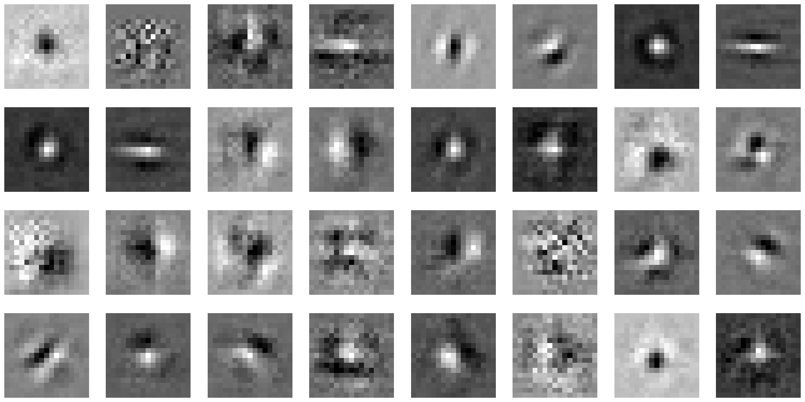

# Receptive Fields overview

## "Lindsey Models"
Notes:
- No stride used - just large kernels! (9x9)
- padding used?...
- not implemented (yet)
    - Kernel normalization
    - activity normalization after each layer appears to result in smoother RFs
    - adding gaussian noise to input / after retina (not really used in their programming / analysis though)

BN Channels - 1
| Layer | Grayscale input | Color |
| -- | -- | -- |
| Bottleneck |  |  |
| V1 |  |  |
| V2 |  |  |

BN Channels - 32
| Layer | Grayscale input | Color |
| -- | -- | -- |
| Bottleneck |  |  |
| V1 |  |  |
| V2 |  |  |

Lindsey32

| C | Img|
| -- | -- | -- |
| B |  |
| G |  |
| R |  |